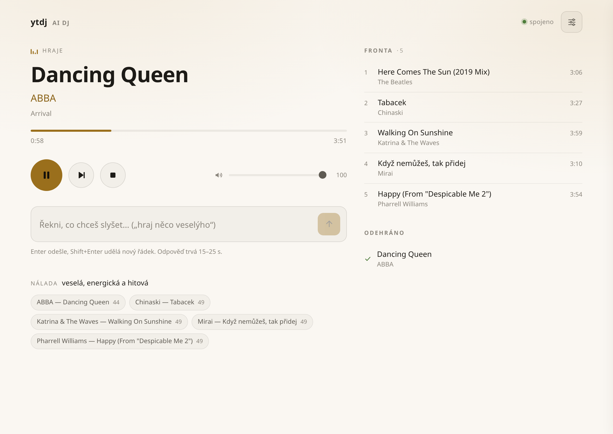

# ytdj — an AI DJ for YouTube Music

[](https://www.python.org/)
[](LICENSE)
[](#requirements)

Tell it what you feel like hearing, in plain language. An LLM turns that into
concrete seed tracks, YouTube Music turns those into radios, and the music
keeps playing until you say stop.

The brain runs **on your ChatGPT/Codex subscription** via the Codex CLI — no
API key is ever entered or stored.

```
» play something upbeat
Putting on a varied, cheerful mix of Czech and international hits across the decades.
▶ Kryštof — Cesta (feat. Tomáš Klus)
» something calmer, I'm going to sleep
Winding it down into a gentle mix of acoustic ballads and dreamy atmosphere.
```

> The DJ persona currently replies in Czech (see
> [Limitations](#limitations)); the examples above are translated.



## Features

- **Natural-language DJ** — "something upbeat", "calmer, I'm going to sleep",
  "more like the last one" all work; deterministic commands (skip, pause,
  volume) bypass the model entirely and react instantly
- **Runs on your existing subscription** — uses the Codex CLI under your
  ChatGPT plan; no API key, no extra cost
- **Music never stops** — the queue keeps filling from prefetched pools even
  when the model is slow or fails
- **Web remote control** — live now-playing view, queue, controls, and
  settings at `http://127.0.0.1:8765`, usable from a phone
- **YouTube Music Premium quality** (256 kbps) when you have a subscription
  and browser cookies — works without them too, at standard quality
- **Learns your taste** — play history, skips, and a blacklist are kept in a
  local SQLite database and fed back into seeding

## How it works

The model **does not pick every track** — that would be slow, repetitive, and
after an hour it would exhaust its mental playlist. Instead:

1. From your request it derives **3–5 seed tracks** (this is what LLMs are
   good at — knowing what "upbeat" means in your context). It returns them as
   a structured JSON decision.
2. **The app looks them up itself** in the YouTube Music catalog and expands
   each into an **independent YouTube radio** (~50 tracks).
3. The queue is filled **round-robin across all pools**. This is the trick:
   a single seed drifts toward one artist within ~20 tracks, but interleaving
   five seeds holds the mood for hours — for free, because the model is no
   longer involved.
4. The model is consulted again only when you say something, the pools run
   dry, or you skip a lot.

If Codex fails or is slow, **the music keeps playing** — the queue filler
draws from already-fetched pools and never waits for the model.

```
request ──▶ codex exec ──JSON──▶ app: search ──▶ pools (per seed, ~50 tracks)
                                                     │ round-robin
                                                     ▼
                                                   queue ──▶ mpv
                                                     ▲
                          re-seeding from finished ──┘
```

### Why the LLM gets no tools

The first version exposed the catalog to Codex as an MCP server on localhost.
That only half-works: Codex connects and sees the tools, but in
non-interactive mode it **cancels every call** (`user cancelled MCP tool
call`) — it waits for an approval nobody is there to give. The only thing
that opens that gate is `--dangerously-bypass-approvals-and-sandbox`, which
also removes the sandbox around the shell. Verified dead ends:
`approval_policy="never"` and `approvals_reviewer="auto_review"` don't help,
and the shell can't be taken away from Codex (`ToolsToml` only has
`web_search` and `experimental_request_user_input`).

Since YouTube track titles — i.e., untrusted third-party input — flow back
into the model's context, trading the sandbox for convenience was not worth
it. Instead, a structured decision is extracted via `--output-schema` and the
app does its own searching and playback. Side effect: one pass instead of
seven, so it's **faster** (16–21 s per request instead of ~30 s).

## Requirements

- Linux (uses mpv over a unix socket; tested on Ubuntu 24.04)
- Python 3.12+
- [mpv](https://mpv.io/) and ffmpeg
- [yt-dlp](https://github.com/yt-dlp/yt-dlp)
- Node.js in `PATH` (yt-dlp needs a JS runtime to resolve YouTube signatures;
  an nvm-installed node is detected automatically)
- [Codex CLI](https://github.com/openai/codex) installed and logged in
  (`codex login`) with a ChatGPT subscription

## Installation

```bash
sudo apt install -y mpv ffmpeg
uv tool install yt-dlp --with secretstorage    # secretstorage: Chrome cookie decryption
uv venv --python 3.12 .venv
uv pip install --python .venv/bin/python -e .
./run.sh
```

On first run a config file is created at `~/.config/ytdj/config.toml` and the
browser profile with a logged-in YouTube account is auto-detected.

```
ytdj              terminal REPL + web UI
ytdj --web-only   web UI only (for running in the background)
ytdj --no-web     terminal only
```

## Usage

Anything you type goes to the DJ — except deterministic commands, which are
handled **without the model**, instantly:

| command | effect |
|---|---|
| `next` / `skip` / `n` | skip |
| `pause` / `p` | pause |
| `resume` / `play` | resume |
| `stop` | stop and clear the queue |
| `+` / `-` / `volume 70` | volume up / down / set (remembered across restarts) |
| `status` / `?` | now playing |
| `help` / `h` | command list |
| `quit` / `exit` | exit |

Czech variants (`další`, `pauza`, `hlasitěji`, …) work too — see `ui/repl.py`.

Everything else is a full Codex request (16–21 s).

## Web UI & API

Alongside the terminal, the app serves a web remote at
**http://127.0.0.1:8765** — now playing, queue, controls, DJ prompt box, and
settings. It runs in the same event loop as the player, so it's a second view
of the same state, not a separate service.

- Smooth position indicator (interpolated locally, no per-second jumps)
- Live updates over SSE (`/api/events`) with automatic fallback to polling
- Settings form is generated from the config schema; options that need a
  restart (formats, cookies, language) are marked
- Responsive — usable from a phone if you set `web_host = "0.0.0.0"`

Disable with `web_enabled = false` in `config.toml`.

The API, if you want to script it:

| endpoint | description |
|---|---|
| `GET /api/status` | player state, queue, history |
| `GET /api/events` | SSE stream of the same |
| `POST /api/prompt` | `{"text":"..."}` → `{"reply":"..."}`; 409 while Codex is busy |
| `POST /api/control` | `{"action":"play\|pause\|next\|stop\|volume","value":int}` |
| `GET/POST /api/config` | read and write `config.toml` |

> **No authentication** — that's why it binds to `127.0.0.1`. Before exposing
> it to your network, understand that anyone on it can then change the
> configuration and spend requests against your subscription.

## Configuration

`~/.config/ytdj/config.toml`, created on first run. The important keys:

| key | default | meaning |
|---|---|---|
| `codex_model` | `""` | `""` = Codex CLI default; e.g. `"gpt-5.4-mini"` is faster and cheaper on limits |
| `web_enabled` / `web_host` / `web_port` | `true` / `127.0.0.1` / `8765` | web remote |
| `language` / `location` | `cs` / `CZ` | YouTube Music catalog language and region |
| `cookies_browser` | auto-detected | browser profile for yt-dlp cookies, e.g. `"chrome:Profile 2"`; `"none"` = no cookies |
| `ytdl_format` | `774/141/251/140/bestaudio` | audio format preference (Premium first) |
| `queue_target` / `queue_low` | `5` / `3` | how far ahead the queue is kept filled |
| `radio_limit` | `50` | tracks fetched per seed radio |
| `repeat_days` | `30` | don't repeat a track for N days |
| `min_duration` / `max_duration` | `60` / `600` | track length filter (seconds) |
| `artist_window` | `10` | max 2 tracks per artist within N tracks |

## Premium audio quality

Playback goes through yt-dlp with browser cookies. Three things without which
Premium formats (774 Opus 256k / 141 AAC 256k) are never even offered — and
which the docs are silent about:

- `secretstorage` must be importable in yt-dlp's environment, or it can't
  decrypt Chrome cookies
- `--js-runtimes=node` and `--remote-components=ejs:github`, or signature
  resolution fails (silent degradation to 128k)
- `node` must be in the `PATH` of mpv's subprocess (the config finds it in
  nvm too)

Verify Premium works — you'll recognize it during playback by a ~256–290k
bitrate:

```bash
yt-dlp --js-runtimes node --remote-components ejs:github \
  --cookies-from-browser "chrome:Profile 2" \
  -F "https://music.youtube.com/watch?v=dQw4w9WgXcQ" | grep 'audio only'
```

Multiple Chrome profiles may be logged in while only one has Premium — set
the right one in `config.toml`. Without cookies it still plays, at 128k opus:
`cookies_browser = "none"`.

**Risk:** yt-dlp with cookies is the only place where your account is
exposed. Documented enforcement by YouTube consists of IP blocks and cookie
invalidation, not account deletion — but it's a real trade-off, not zero
risk. If that bothers you, `cookies_browser = "none"` removes it entirely
(at the cost of quality).

## ytmusicapi login (optional)

Search and radio work **anonymously**. A login is only needed for your
library, history, and likes:

```bash
./.venv/bin/ytmusicapi browser   # paste request headers from DevTools
mv browser.json ~/.config/ytdj/
```

Do **not** use OAuth — since August 2025 the YouTube Music server rejects the
Bearer token ([ytmusicapi#813](https://github.com/sigma67/ytmusicapi/issues/813),
still open).

## Cost

Nothing extra — it runs on your subscription. Note, however, that every
request is a full Codex session (~12k input tokens due to its own system
prompt), so it counts against your plan's limits. Passive listening, when you
say nothing, costs nothing.

Faster and lighter on limits: `codex_model = "gpt-5.4-mini"` in the config.

## Privacy & security

- **No API keys or passwords are stored** — Codex CLI keeps its own OAuth
  session in `~/.codex/auth.json`; this app never sees it.
- **What leaves your machine:** your music requests and track titles go to
  the model provider through Codex; YouTube Music queries carry your cookies
  if enabled. Nothing else.
- **Local state** (`~/.local/share/ytdj/`): play history, ratings, blacklist —
  plain SQLite, delete it anytime.
- The web UI is unauthenticated and bound to localhost by default (see
  [Web UI & API](#web-ui--api)).

## Limitations

- The DJ role prompt (`ytdj/agent/prompts.py`) is written in Czech, so
  replies come back in Czech regardless of the `language` setting — that key
  only affects the YouTube Music catalog. An English persona is a matter of
  editing one prompt file.
- Linux only for now: the player talks to mpv over a unix socket.

## Project layout

```
ytdj/
  config.py    XDG paths, browser & node auto-detection, config migration
  state.py     SQLite: history, ratings, blacklist, long-term taste
  music/
    catalog.py ytmusicapi → compact Track (thumbnails and feedback tokens stripped)
    radio.py   seed pools, round-robin, filters (repeats, length, artist cap)
  player/
    base.py    Player interface — agent logic does not depend on mpv
    mpv.py     JSON IPC over a unix socket
  agent/
    codex.py   `codex exec --output-schema`, decision execution
    prompts.py DJ role + JSON response contract
  ui/repl.py   prompt_toolkit + fast local path for commands
  web/
    server.py  starlette + uvicorn, REST + SSE, config writes
    static/index.html  the whole frontend in one file, no build step
```

The terminal and the web UI share one lock for Codex calls (`App.ask`), so
two turns can never interleave and overwrite each other's pools — automatic
re-seeding included.

Swapping the player (e.g. for pear-desktop / YTMDesktop, where Premium plays
through a real web player and yt-dlp drops out) means writing another
implementation of `player/base.py:Player`. Nothing else changes.

## Development notes

Hard-won details that are easy to re-discover the painful way:

- `limit` in ytmusicapi is a **lower** bound, not an upper one — YTM paginates
  by 20; we trim on our side.
- ytmusicapi stuffs play counts ("3.4M plays") into the `artists` field — we
  filter them out, or they leak all the way into the prompt.
- `get_watch_playlist(radio=True)` returns a different mix every time. There
  is no reproducibility, so actual `videoId`s are stored, not the seed.
- `shuffle=True` crashes on `RDCLAK5` playlists — we don't use it.
- mpv events must not be handled inside the read loop — the handler would
  wait for a reply that the same loop is supposed to read. Hence a separate
  dispatch loop.
- `end-file` carries a `reason` that distinguishes *finished* from *skipped* —
  that's the implicit feedback re-seeding is based on.
- `codex exec resume` accepts neither `-C` nor `-s`; both are inherited from
  the original session and must be omitted on resume.
- Codex writes a `trust_level` for every working directory into
  `~/.codex/config.toml` — that's why ytdj uses a **stable** working
  directory (`~/.local/share/ytdj/codex-workdir`), not a `mkdtemp` per run.
- The web server runs in the same asyncio loop as the player. Anything that
  blocks the loop (say, a synchronous `subprocess.run`) blocks the web too —
  easy to fall for in tests.
- mpv's `clear_queue` lets the current track finish. On a mood change the app
  therefore skips once more after the new queue is filled, otherwise the new
  music would only start three minutes later.

## Contributing

Issues and pull requests are welcome. The codebase is small and commented —
start with [Project layout](#project-layout). Please keep changes focused and
describe the observed behavior (logs help: `YTDJ_LOG=DEBUG ./run.sh`).

## License

[MIT](LICENSE)
